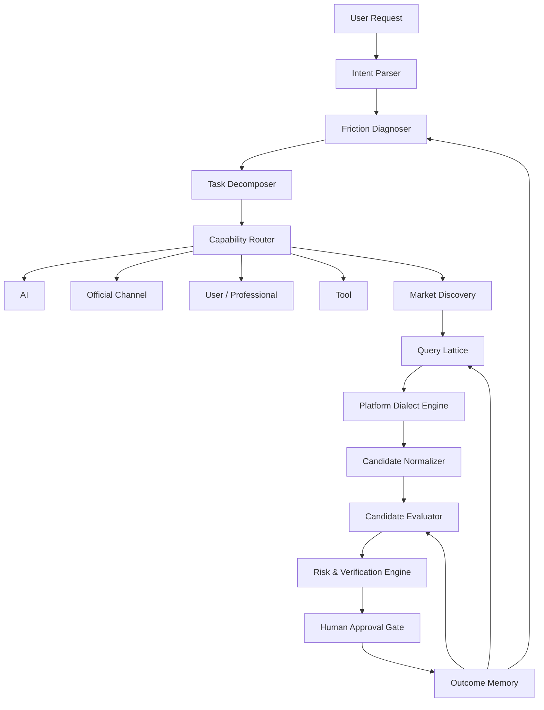

# 系统架构

## 总体数据流



## 核心模块

### 1. Intent Parser

把用户表面描述转为目标、约束、时间、预算、已尝试方法和敏感信息等级。

### 2. Friction Diagnoser

识别主要与次要摩擦：知识、诊断、熟练度、渠道、执行、验证。输出证据和置信度，不只输出标签。

### 3. Task Decomposer

将目标拆成可以分别路由的子任务。子任务必须有输入、预期交付、失败后果和是否需要本人参与。

### 4. Capability Router

在 `AI / TOOL / SELF / PROFESSIONAL / MARKET / OFFICIAL` 之间选择。一个案例可以混合多个路径。

### 5. Query Lattice Generator

按问题、动作、交付物、职业身份、平台表达和负面过滤词构造查询网格。

### 6. Platform Dialect Engine

识别简拼、谐音、错别字、图片表达、包装商品、占位价格和“具体私聊”等信号。输出候选含义、证据和置信度。

### 7. Candidate Normalizer

将不同卖家的描述统一为：真实服务、交付物、人员背景、价格结构、所需资料、时效、保证、风险。

### 8. Candidate Evaluator

分别计算相关度、专业度、交付清晰度、可信度、可验证性和风险。风险不得被高相关度抵消。

### 9. Risk & Verification Engine

检测账号权限、验证码、证件、支付控制、平台外交易、伪造、内部渠道、百分百承诺等风险，并生成需要追问的问题。

### 10. Outcome Memory

保存脱敏后的案例结果：选择的路径、搜索词、服务层级、实际花费、时间、是否成功和异常情况。

## 分层原则

```text
Domain Layer       目标、摩擦、任务、路由、候选、风险、结果
Policy Layer       安全规则、人工确认、可外包边界
Knowledge Layer    职业、服务、平台词、交付标准、风险规则
Adapter Layer      LLM、搜索、浏览器、OCR、图像、存储
Interface Layer    CLI、Skill、API、UI
```

核心领域层不得依赖具体模型或平台 SDK。

## 人工确认点

以下动作必须停在人工确认：

- 提供密码、验证码、身份证件或支付信息；
- 登录账号或远程控制；
- 付款、签字或提交材料；
- 离开平台担保交易；
- 接受涉及违规、伪造或内部权限的承诺；
- 医疗、法律、金融等高风险决定。

## 可扩展适配器

后续建议接口：

- `LLMAdapter`：结构化理解和解释；
- `SearchAdapter`：公开网页与平台搜索；
- `BrowserAdapter`：用户授权下的浏览器协助；
- `VisionAdapter`：截图、商品图片、价格表和聊天记录；
- `StorageAdapter`：SQLite、PostgreSQL、向量检索；
- `PolicyAdapter`：不同地区与平台政策。
